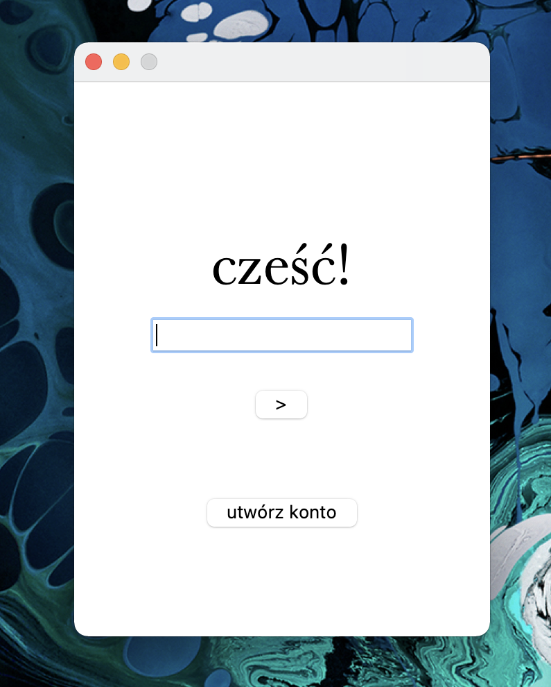

# Password manager
> Password manager with GUI built in Python using built-in tkinter module and cryptography module to store encrypted passwords with your master password on your local machine.

## Table of Contents
* [General Info](#general-information)
* [Technologies Used](#technologies-used)
* [Features](#features)
* [Screenshots](#screenshots)
* [Setup](#setup)
* [Usage](#usage)
* [Project Status](#project-status)
<!-- * [Room for Improvement](#room-for-improvement) -->
* [Contact](#contact)
<!-- * [License](#license) -->

## General Information
- The purpose of this project was for me to build clean, minimalistic user interface with tkinter, play with cryptography module and build something as useful as password manager.
- As it encrypts all informations based on your master password and stores it on your local machines, encrypted, it is very safe place for all your important notes and if you lost your master password, you will loose all of your informations as they will be just a mess of encrypted letters somewehere on your computer.

## Technologies Used
- Python 3.7
- Python built-in 'tkinter' module
- Python 'cryptography' module

## Features
- Creating many accounts with different encryptions based on password to them (you can't restore password if you lost it, and can't log in to account in any different way than using username and password you type in while creating account)
- Storing encrypted passwords on your local machine, encrypted with your password
- While being logged in, you can search for specific password/site, passwords are saved in a big note text
- App creates folder with encrypted data on your disk, in Documents folder

## Screenshots

<!-- If you have screenshots you'd like to share, include them here. -->

## Setup
To run this project, you need Python 3.x, then run:
`pip3 install cryptography`
And that is all you need for building this.

## Usage
After building app, you have to create new account by typing first login and then password.
If you do so, then log in to your account and add new passwords to that big note text.
Every time you close the app, passwords are being encrypted and written on your local disk.
Every time you open the app, you have to log in to decrypt and show your passwords.

## Project Status
Project is in progress, I will probably add some extra functionality and fix future bugs.

<!--
## Room for Improvement

Room for improvement:
- Improvement to be done 1
- Improvement to be done 2

To do:
- Feature to be added 1
- Feature to be added 2
-->

## Contact
Feel free to contact me on my website https://mblaszczykowski.pl in "KONTAKT" bookmark, there is my e-mail, but for now website is only in Polish language. I will add English version soon.

## Extra
App was only build on MacOS Big Sur, for now I don't even know how it looks on Windows. I am saying this, because when I created an app for Windows and run it on Mac, it looked completely different.
<!-- ## License -->
<!-- This project is open source and available under the [... License](). -->

<!-- You don't have to include all sections - just the one's relevant to your project -->
