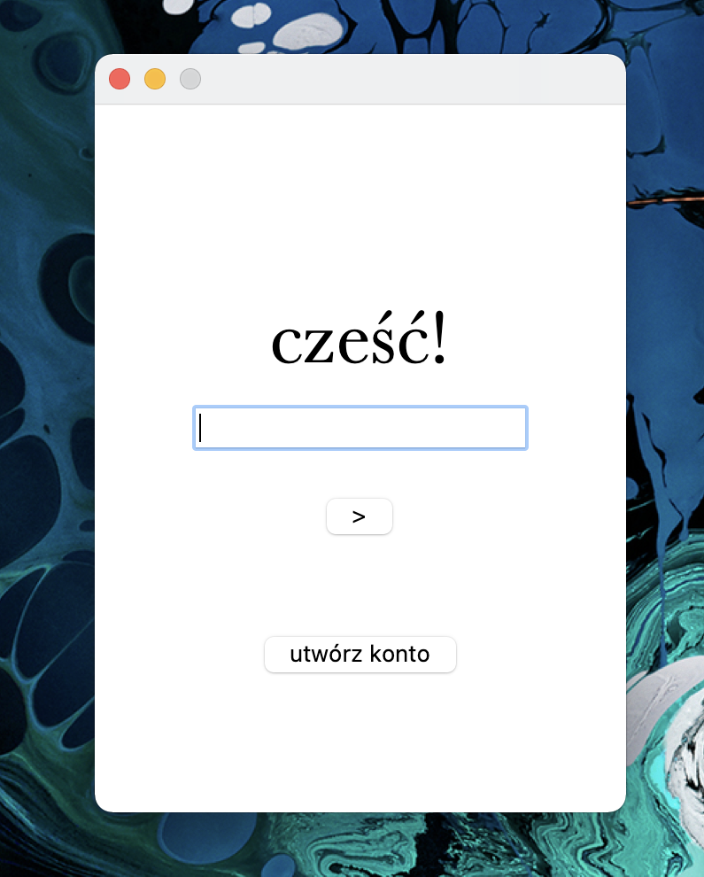

# Password manager
> Password manager with GUI built in Python using built-in tkinter module and cryptography module to store encrypted passwords with your master password on your local machine.

## Table of Contents
* [General Info](#general-information)
* [Technologies Used](#technologies-used)
* [Features](#features)
* [Screenshots](#screenshots)
* [Setup](#setup)
* [Usage](#usage)
* [Project Status](#project-status)
* [Room for Improvement](#room-for-improvement)
* [Contact](#contact)
<!-- * [License](#license) -->

## General Information
- The purpose of this project was for me to build clean, minimalistic user interface with tkinter, play with cryptography module and build something as useful as password manager.
- As it encrypts all informations based on your master password and stores it on your local machines, encrypted, it is very safe place for all your important notes and if you lost your master password, you will loose all of your informations as they will be just a mess of encrypted letters somewehere on your computer.

## Technologies Used
- Python 3.7
- Python built-in 'tkinter' module
- Python 'cryptography' module

## Features
- Awesome feature 1
- Awesome feature 2
- Awesome feature 3

## Screenshots

<!-- If you have screenshots you'd like to share, include them here. -->

## Setup
To run this project, you need Python 3.x, then run:
`pip3 install cryptography`
And that is all.

## Usage
How does one go about using it?
Provide various use cases and code examples here.

`write-your-code-here`

## Project Status
Project is: _in progress_ / _complete_ / _no longer being worked on_. If you are no longer working on it, provide reasons why.

## Room for Improvement
Include areas you believe need improvement / could be improved. Also add TODOs for future development.

Room for improvement:
- Improvement to be done 1
- Improvement to be done 2

To do:
- Feature to be added 1
- Feature to be added 2

## Contact
Created by [@flynerdpl](https://www.flynerd.pl/) - feel free to contact me!

<!-- Optional -->
<!-- ## License -->
<!-- This project is open source and available under the [... License](). -->

<!-- You don't have to include all sections - just the one's relevant to your project -->
